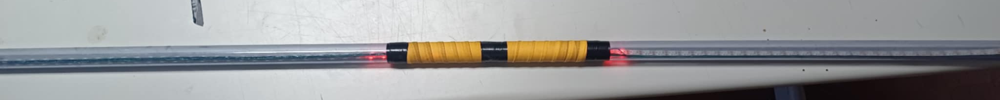
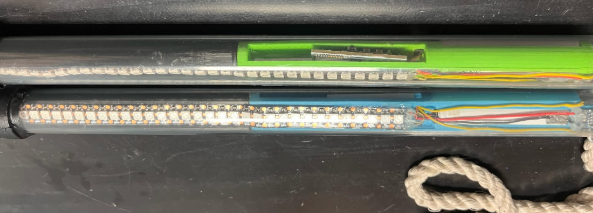
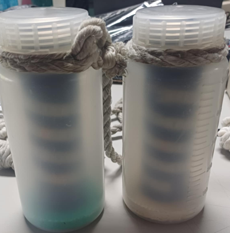

# Lux

A wireless LED performance prop system from the Department of Engineering Science, NCKU. As the props spin, they use **Persistence of Vision (POV)** to draw 2D images in the air, synchronized over Wi-Fi to music. They are mainly performed at freshman orientation camps.

> Full design write-up (electronics, mechanical, firmware, editor): [LightPOV project page](https://hsupingjhao.info/projects/LightPOV/)

## Devices

| Device | Photo | Description | Code |
|---|:---:|---|---|
| **Light Stick** |  | ESP32 + WS2812 LED strip in a transparent PC tube, powered by an 18650 Li-ion battery | [`LightPOV/`](LightPOV/) |
| **Light Snake** |  | Shares the Stick's ESP32 core board and firmware, swung on a rope | [`LightPOV/`](LightPOV/) |
| **Light Ball** |  | ESP-12F (ESP8266) + RGB LEDs in a semi-transparent PE container | [`LightBall/`](LightBall/) |

## 🎬 Performances

Click a thumbnail to watch on YouTube.

**117th Freshman Orientation Camp**

| Stick | Ball | Snake |
|:---:|:---:|:---:|
| [](https://www.youtube.com/watch?v=YyiI2fg6KxA) | [](https://youtu.be/KIUfSW9J6ho) | [](https://www.youtube.com/watch?v=Cy09c8EzSV8) |

| 27th ESCamp (Stick, Ball, Snake) | 118th Freshman Orientation Camp (Stick) |
|:---:|:---:|
| [](https://www.youtube.com/watch?v=DXz8Qr7GCnU) | [](https://www.youtube.com/watch?v=Ix1kZmECrI4) |

## Repository Layout

| Folder | Contents | Status |
|---|---|---|
| [`LightPOV/`](LightPOV/) | Stick & Snake: ESP32 firmware, effect editor (ControlPanel_v3), PCB and 3D models | Active development |
| [`LightBall/`](LightBall/) | Ball: ESP8266 firmware, controller, C# helper tool, PCB | Maintained |

`LightPOV/legacy/` holds previous control panels and past performance files. It is kept for reference only, so please don't develop in it.

## Usage

### Requirements

- [Node.js](https://nodejs.org/) 20+
- [Arduino IDE](https://www.arduino.cc/en/software) with the ESP32 board package and the `FastLED`, `cppQueue` and `MPU6050` libraries

### 1. Effect editor (ControlPanel_v3)

```bash
cd LightPOV/ControlPanel_v3
npm install
npm run dev        # open http://localhost:3000
npm run test       # run unit tests
```

### 2. Hardware server

The props fetch effects and sync time from the server over Wi-Fi. Each server serves a different prop:

| Server | How to start | Port | Prop |
|---|---|---|---|
| `ControlPanel_v3/server/server.ts` | `cd LightPOV/ControlPanel_v3/server && npm install && npm run start` | 10240 | TBD |
| `ControlPanel_v3/src/server/server.js` | `cd LightPOV/ControlPanel_v3/src/server && npm install && node server.js` (on Windows, run `啟動server.bat`) | 20480 | TBD |

### 3. Flashing the firmware (LightPOV)

1. Open `LightPOV/ESP32/ESP32.ino` in Arduino IDE
2. Set the Wi-Fi SSID/password and `LUX_ID_DEFAULT` (each prop's ID) in `config.h`
3. Select the ESP32 board and upload; later updates can be pushed over Wi-Fi (OTA)

### 4. Performance workflow

TBD (edit effects → push to server → props connect → play music to start)

### LightBall

```bash
cd LightBall/controller
npm install
node server.js     # open http://localhost:3000
```

The firmware is in `LightBall/Code/LightBall_v2/`.

### Developer docs

- [ControlPanel_v3 developer quick start](LightPOV/ControlPanel_v3/docs/README.md) (Chinese)
- [Architecture](LightPOV/ControlPanel_v3/docs/architecture.md)
- [Hardware protocol](LightPOV/ControlPanel_v3/docs/hardware-protocol.md)

For questions, please open an [Issue](https://github.com/ivan125126/light_light_light/issues).

## What's Next

**Hardware**
- [ ] Bring up the [core PCB v2.0](LightPOV/hardware/PCB/core_pcb/) (chip-down ESP32, 14500 battery, JST connectors) and verify it works end to end
- [ ] Measure whether the LED strip draws more than 2 A from the independent power supply
- [ ] Magnetic charging with a 3D-printed enclosure
- [ ] Next-generation device: replace modules with mounted electronics to shrink the core radius

**Software**
- [ ] Document the end-to-end performance workflow (the TBD items above)

## Acknowledgements

This project is forked from [sciyen/ES-Lux](https://github.com/sciyen/ES-Lux) (NCKU ES Makers Program). Thanks to the original authors [@sciyen](https://github.com/sciyen) and [@BensonYang1999](https://github.com/BensonYang1999). The Lux-starter kit from the original project is not included in this repo; see the upstream repo if you need it.

Licensed under the [BSD 3-Clause License](LICENSE).
